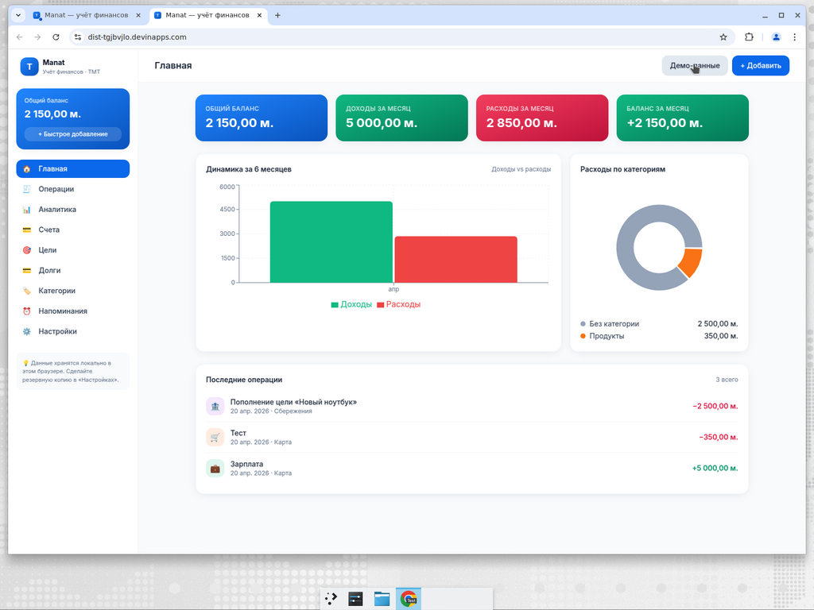
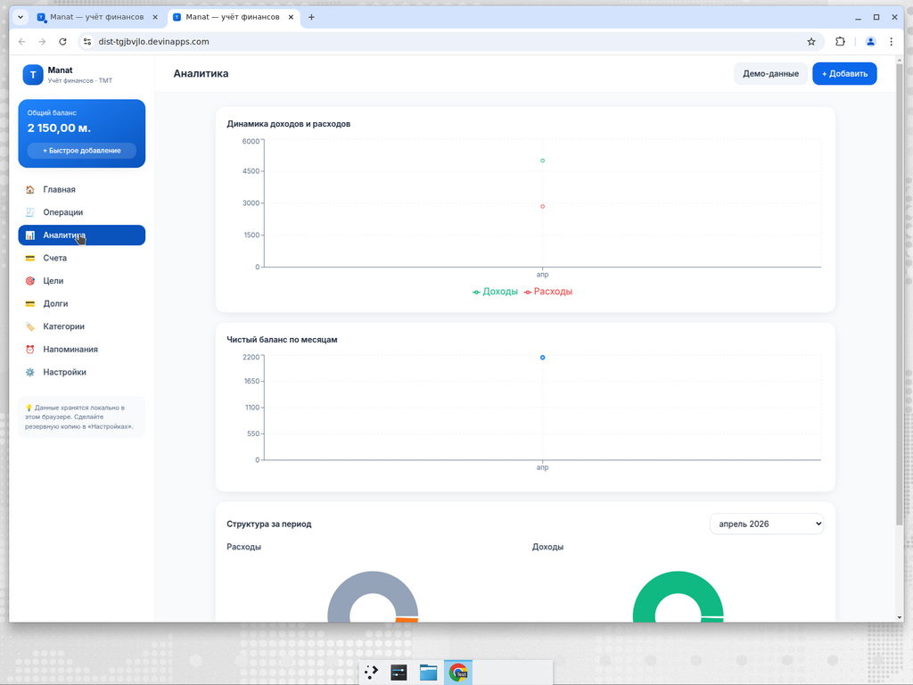
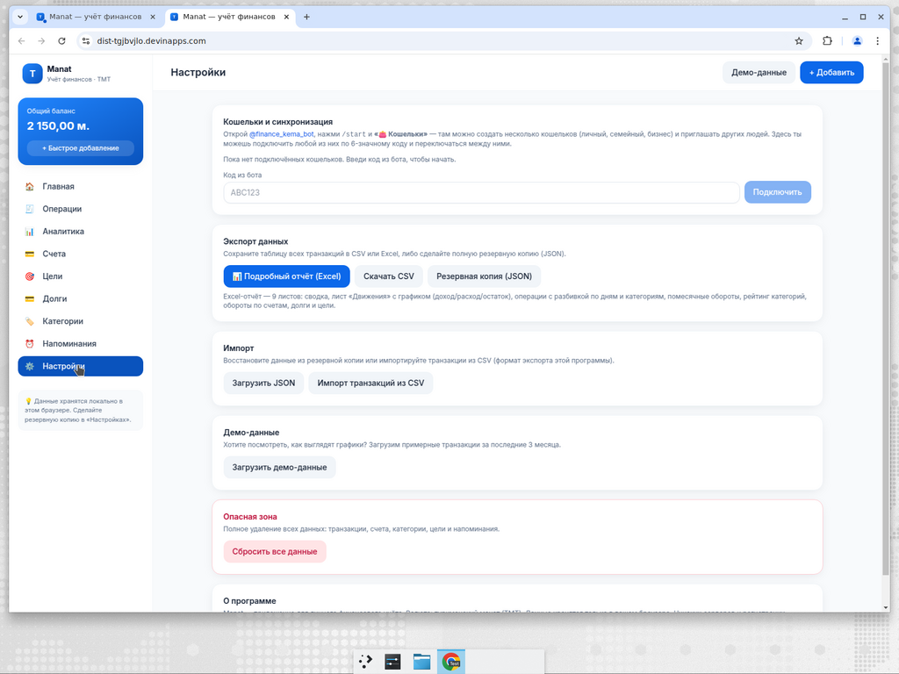

# Manat — семейный учёт финансов + Telegram-бот

**Manat** — это веб-приложение и Telegram-бот для учёта доходов, расходов, долгов
и целей накоплений в туркменских манатах (TMT). Всё в одном месте, работает
параллельно с телефона (бот) и с компьютера (сайт), данные синхронизируются
автоматически.

**Живая версия (можно сразу попробовать):**
- 🌐 Сайт: https://dist-tgjbvjlo.devinapps.com
- 🤖 Telegram-бот: https://t.me/finance_kema_bot
- 🔌 Backend (API): https://manat-backend-txrnbhuq.fly.dev



---

## Возможности

- 💸 **Учёт доходов, расходов, переводов** между счетами (наличные, карта, сбережения…).
- 🏷 **Категории** с иконками и цветами — свои или готовые.
- 🏦 **Долги** с датой оплаты и прогрессом погашения.
- 🎯 **Цели накоплений** с дедлайном и прогресс-баром.
- 👛 **Мульти-кошельки**: «Личный», «Семейный», «Бизнес» — у каждого свой баланс. Можно пригласить жену/коллегу в любой кошелёк по коду.
- 🔒 **PIN-защита** кошелька: без PIN сайт ничего не покажет.
- 🔔 **Ежедневные напоминания** в 09:00 (Ашхабад) о скором списании долгов и дедлайнах целей.
- 🤖 **AI-советник** (OpenRouter / Gemma): «когда закрою кредит если буду платить по 500?», «на чём сэкономить?».
- 📊 **Подробный Excel-отчёт** (9 листов, включая график доход/расход/остаток), плюс CSV и JSON-бэкап.
- 📱 **Mobile-first UI**: нижняя навигация, крупные кнопки, нет iOS-зума при вводе.

| Аналитика | Настройки и экспорт |
|-----------|---------------------|
|  |  |

---

## Архитектура

```
┌──────────────┐   code + PIN   ┌───────────────┐   webhook   ┌──────────────┐
│ Frontend     │ ─────────────> │ Backend       │ <────────── │ Telegram API │
│ React + Vite │ <──── token ── │ FastAPI + bot │             └──────────────┘
└──────────────┘   Bearer       └───────┬───────┘
                                        ▼
                                     manat.db  (SQLite)
```

- **Frontend** — статический сайт (React 19 + TypeScript + Vite + Tailwind).
- **Backend** — Python 3.11+ / FastAPI / SQLAlchemy / SQLite. Telegram-бот работает в том же процессе.
- **Данные** лежат только в backend, в файле `manat.db`. Фронтенд ничего не хранит, кроме «какой кошелёк я открыл в этом браузере».
- **Авторизация**: у каждого кошелька есть 6-значный код (видно в боте → «🔗 Код»). Владелец может поставить PIN («🔒 Поставить код-пароль») — тогда без PIN сайт ничего не отдаст.

---

## Быстрый старт: запуск локально

Нужно: **Node.js 20+** и **Python 3.11+**.

### 1. Клонировать репозиторий

```bash
git clone https://github.com/kem4ik92/Finance.git
cd Finance
```

### 2. Backend (Python + Telegram-бот)

Backend нужен для синхронизации сайта и бота. Если хочешь только UI без бота — можешь пропустить и сразу идти к шагу 3, но ничего не будет сохраняться между устройствами.

```bash
cd backend
python -m venv .venv
source .venv/bin/activate          # Windows: .venv\Scripts\activate
pip install -e .
```

Создай файл `backend/.secrets.env` (шаблон: `backend/.secrets.env.example`):

```env
TELEGRAM_BOT_TOKEN=123456789:AA...   # получить у @BotFather → /newbot
PUBLIC_BASE_URL=                     # оставь пустым для локалки без бота
OPENROUTER_API_KEY=                  # опционально, для кнопки «🤖 AI»
OPENROUTER_MODEL=google/gemma-4-26b-a4b-it:free
MANAT_DB_PATH=./manat.db
```

> Локально webhook Telegram не работает — нужен HTTPS. Если нужен бот на локальной машине, используй [ngrok](https://ngrok.com/) / [cloudflared](https://developers.cloudflare.com/cloudflare-one/connections/connect-networks/) и подставь публичный HTTPS-URL в `PUBLIC_BASE_URL`.

Запуск:

```bash
uvicorn app.main:app --reload --host 127.0.0.1 --port 8080
```

Проверь: `curl http://127.0.0.1:8080/healthz` → `{"ok": true}`.

### 3. Frontend (сайт)

В другом терминале из корня репозитория:

```bash
npm install
npm run dev
```

Vite откроет http://localhost:5173 (адрес покажет в консоли).

Если backend поднят **не** на `http://127.0.0.1:8080`, укажи его URL в `src/lib/sync.ts` → `DEFAULT_API_BASE` или через переменную окружения `VITE_API_BASE`:

```bash
VITE_API_BASE=https://your-backend.example npm run dev
```

### 4. Привязка сайта к боту

1. Напиши `/start` боту `@finance_kema_bot` (или своему, если запустил локально).
2. Нажми «🔗 Код» — бот покажет 6-значный код.
3. На сайте: **Настройки → Кошельки** → вставь код → «Подключить».
4. Любая операция (бот или сайт) теперь видна в обоих местах.

---

## Продакшен: запуск на своём сервере

Коротко. Полная инструкция со всеми опциями (systemd, nginx, Caddy, Docker, Fly.io, бэкапы, ротация токенов) — в [DEPLOY.md](DEPLOY.md).

### Что понадобится

- VPS с Linux (любой провайдер: arka.com.tm, hetzner, timeweb, digital-ocean…).
- Домен с HTTPS для backend, например `https://api.my-finance.example`. **HTTPS обязателен** — Telegram не шлёт webhook на http.
- Токен бота от [@BotFather](https://t.me/BotFather).

### Способ A: Docker (одна команда)

```bash
git clone https://github.com/kem4ik92/Finance.git
cd Finance
docker build -t manat-backend ./backend
docker run -d --name manat \
  -p 8080:8080 \
  -v /srv/manat-data:/data \
  -e TELEGRAM_BOT_TOKEN=123456789:AA... \
  -e PUBLIC_BASE_URL=https://api.my-finance.example \
  -e OPENROUTER_API_KEY=sk-or-... \
  -e MANAT_DB_PATH=/data/manat.db \
  --restart unless-stopped \
  manat-backend
```

Потом добавить **reverse-proxy с TLS** перед портом `8080`:

- **Caddy** (самое простое, TLS автоматом):
  ```
  api.my-finance.example {
      reverse_proxy 127.0.0.1:8080
  }
  ```
- **nginx + Let's Encrypt** (конфиг и команды — в [DEPLOY.md](DEPLOY.md#2-backend--ручной-запуск-без-docker)).

### Способ B: systemd без Docker

```bash
git clone https://github.com/kem4ik92/Finance.git /opt/manat
cd /opt/manat/backend
python -m venv .venv && source .venv/bin/activate && pip install -e .
cp .secrets.env.example .secrets.env && nano .secrets.env   # вставь токены
```

Юнит `/etc/systemd/system/manat.service`:

```ini
[Unit]
Description=Manat backend
After=network.target

[Service]
Type=simple
User=manat
WorkingDirectory=/opt/manat/backend
EnvironmentFile=/opt/manat/backend/.secrets.env
ExecStart=/opt/manat/backend/.venv/bin/uvicorn app.main:app --host 127.0.0.1 --port 8080
Restart=on-failure

[Install]
WantedBy=multi-user.target
```

```bash
sudo systemctl daemon-reload && sudo systemctl enable --now manat
```

И так же — прикрути nginx/Caddy поверх 127.0.0.1:8080.

### Способ C: Fly.io (как у меня)

```bash
curl -L https://fly.io/install.sh | sh
cd backend
flyctl launch --no-deploy        # создать app, отказаться от Dockerfile (есть свой)
flyctl secrets set TELEGRAM_BOT_TOKEN=... PUBLIC_BASE_URL=https://<app>.fly.dev
flyctl volumes create manat_data --size 1
flyctl deploy
```

### Frontend на продакшене

```bash
npm install
npm run build
# ↓ папку dist/ положить на любой статик-хостинг
scp -r dist/* user@your-server:/var/www/manat/
```

nginx-конфиг для SPA:

```nginx
server {
  listen 443 ssl;
  server_name manat.my-finance.example;
  root /var/www/manat;
  index index.html;
  location / { try_files $uri /index.html; }
}
```

Или в один клик: **Vercel**, **Netlify**, **Cloudflare Pages** — все понимают Vite автоматически. Перед сборкой задай `VITE_API_BASE` с URL твоего backend.

### Webhook Telegram

Backend сам зарегистрирует webhook по `PUBLIC_BASE_URL/tg/webhook` при старте. Проверить:

```bash
curl "https://api.telegram.org/bot<TOKEN>/getWebhookInfo"
```

Должен вернуть твой URL и `"pending_update_count": 0`.

---

## Технологии

| Часть          | Стек                                                           |
|----------------|----------------------------------------------------------------|
| Frontend       | React 19, TypeScript, Vite, TailwindCSS, Recharts, ExcelJS     |
| Backend / API  | Python 3.11+, FastAPI, SQLAlchemy 2.0, SQLite                  |
| Telegram-бот   | python-telegram-bot 21 (async), FSM, inline-кнопки             |
| AI             | OpenRouter (google/gemma-4-26b-a4b-it:free по умолчанию)       |
| Шедулер        | APScheduler (ежедневные напоминания 09:00 Ашхабад, UTC+5)      |

---

## Безопасность и секреты

- `.secrets.env`, `manat.db`, `node_modules/`, `dist/`, `backend/.venv/` — **в `.gitignore`**, никогда не коммить.
- Токен бота = полный доступ к боту. Светанул в чате → зайди в [@BotFather](https://t.me/BotFather) → `/revoke` → новый токен.
- OpenRouter-ключ можно ограничить лимитом на [openrouter.ai/keys](https://openrouter.ai/keys).
- 6-значный код кошелька = пароль. Если скомпрометирован — «👛 Кошельки» → создай новый, перенеси операции, старый удали.
- Для публичного доступа обязательно включай PIN («🔒 Поставить код-пароль» в боте).

---

## Бэкапы

База данных — это **один файл `manat.db`**.

**Ручной бэкап (с работающим backend — SQLite безопасно копируется горячим):**

```bash
# локально
cp backend/manat.db ~/manat-backup-$(date +%F).db

# на Docker
docker cp manat:/data/manat.db ./manat-backup-$(date +%F).db

# на Fly.io
flyctl ssh console -C 'sqlite3 /data/manat.db ".backup /data/backup.db"'
flyctl ssh sftp get /data/backup.db ./manat-backup-$(date +%F).db
```

**Cron каждую ночь (пример):**

```
0 3 * * * sqlite3 /opt/manat/backend/manat.db ".backup /var/backups/manat-$(date +\%F).db"
```

Из приложения: **Настройки → Резервная копия (JSON)** — скачивает полный снимок данных.

---

## Частые ошибки

| Симптом                                              | Причина / решение                                                                 |
|------------------------------------------------------|-----------------------------------------------------------------------------------|
| Бот не отвечает на `/start`                          | Проверь `getWebhookInfo` — должен быть HTTPS-URL, `last_error_date` пустой.       |
| «Ошибка подключения» на сайте                        | `VITE_API_BASE` указывает не туда, либо у backend нет CORS. См. [DEPLOY.md](DEPLOY.md). |
| «Неверный PIN» после правильного ввода               | PIN недавно поменяли — backend инвалидировал все токены. Введи заново.            |
| Операции из бота не появляются на сайте              | Проверь что сайт подключён к тому же коду (Настройки → «Подключено: XXXXXX»).     |
| `sqlite3.OperationalError: database is locked`       | Два процесса пишут одновременно. Держи backend в одном экземпляре.                |

Полный troubleshooting-раздел — в [DEPLOY.md](DEPLOY.md#9-troubleshooting).

---

## Структура проекта

```
finance-tracker/
├── src/                 # frontend (React + TS)
│   ├── pages/           # Dashboard, Transactions, Debts, Goals, Analytics, Settings…
│   ├── components/      # Modal, TransactionForm, SavingsAdvice…
│   ├── lib/             # sync, report (Excel), currency, date, advice…
│   └── state/           # Context + useReducer
├── backend/
│   ├── app/
│   │   ├── api.py       # REST API
│   │   ├── bot.py       # Telegram-бот (FSM, inline-кнопки)
│   │   ├── reminders.py # ежедневные уведомления
│   │   ├── ai.py        # OpenRouter-клиент
│   │   ├── db.py        # SQLAlchemy модели (Workspace, Account, Transaction, Debt, Goal…)
│   │   └── main.py      # FastAPI entrypoint
│   ├── pyproject.toml
│   ├── Dockerfile
│   └── .secrets.env.example
├── docs/
│   └── screenshots/     # скриншоты для README
├── DEPLOY.md            # подробная инструкция по self-hosting
└── README.md            # этот файл
```

---

## Лицензия

MIT. Делай что хочешь — только не выкладывай свои токены :)
